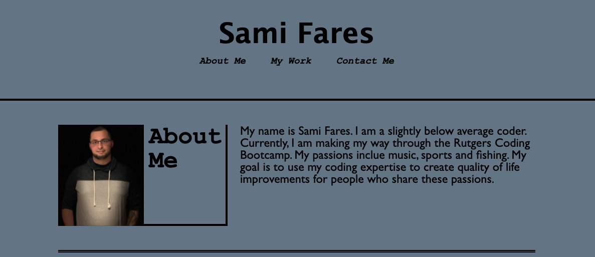
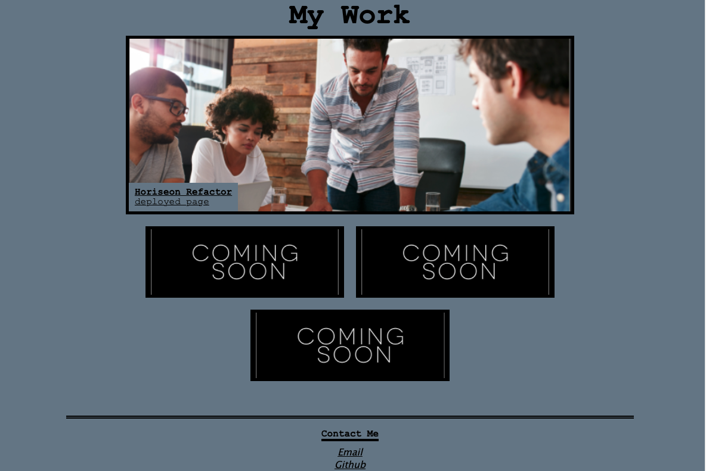

# Read Me

github repo: https://github.com/SamiF812/Portfolio-SamiFares

portfolio: https://samif812.github.io/Portfolio-SamiFares/

Created a portfolio that displays my name, picture, recent projects and a way to contact me.

Styled my header with my name and nav bar centered for a clean look.

I utilized verticle lines/borders to make my page pop a little bit more.

when dividing the about me from the work me section i used a double border for added design and did the same seperating the my work section from the contact me section down beneath.

when in the about me section you will find a blurb about me (placeholder) along with a picture of myself.

the my works showcases my refactor page from the first assignment. This screenshot is linked to the deployed website and appears larger than the coming soon boxes (place holders).

all options in Nav work as expected
both contact me options are linked correctly and working.

I attempted to make the page work responsivley. I ran into a few issues. After seeking help from a few other coders in class I was still unable to get it fully functioning how I intended. Everything else seems good to go and the portfolio is live.